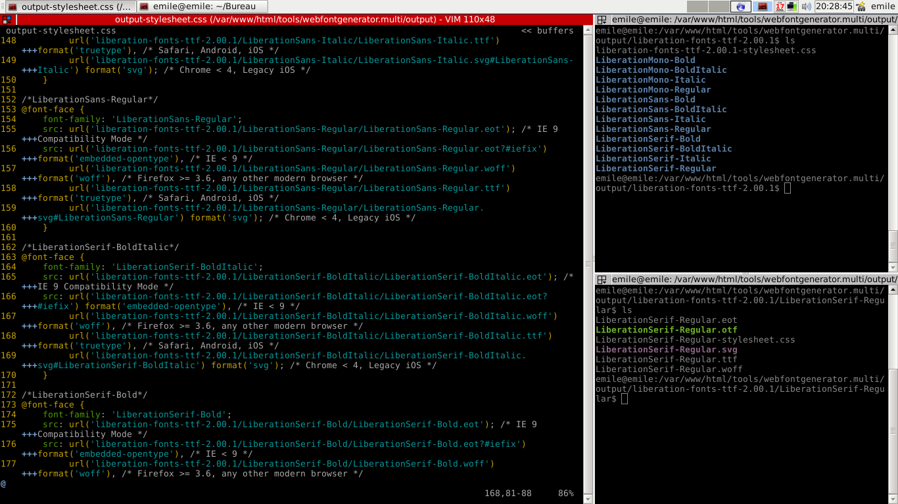

# webfontgenerator 

## Description

A bash script to generate a webfont kit (font files and css files) from otf or ttf.

## Ressources

EtienneOz/WebfontGenerator  
https://github.com/EtienneOz/WebfontGenerator

## Previews



## Install

Install those dependencies :

- woff-tools
- fontforge
- eot-utils
- ttfautohint


    sudo apt-get install woff-tools fontforge eot-utils ttfautohint

Clone this repo on your computer

    sudo git clone https://github.com/emilegreis/webfontgenerator.git

You may need to pass executable mode on bash files

    sudo chmod +x webfontgenerator.bash clean_output.bash clean_input.bash

## use

Déplacer les familles de fonts dans le dossier `/webfontgenerator/input` en
respectant la hiérarchie suivante :

```
    webfontgenerator
	input
	    famille-1
		font-A.(otf/ttf)
		font-B.(otf/ttf)
		font-C.(otf/ttf)
		...
	    famille-2
		font-A.(otf/ttf)
		font-B.(otf/ttf)
		font-C.(otf/ttf)
		...
	    ...
```

Les noms des dossiers et des fichiers seront conservés pour la génération des fichiers
fonts et des feuilles de styles. Seuls les fichiers .otf ou .ttf sont supportés.


Lancer le generator

    ./generator.bash

Les fichiers sont générés dans le dossier output.

    cd /webfontgenerator/output

## license


